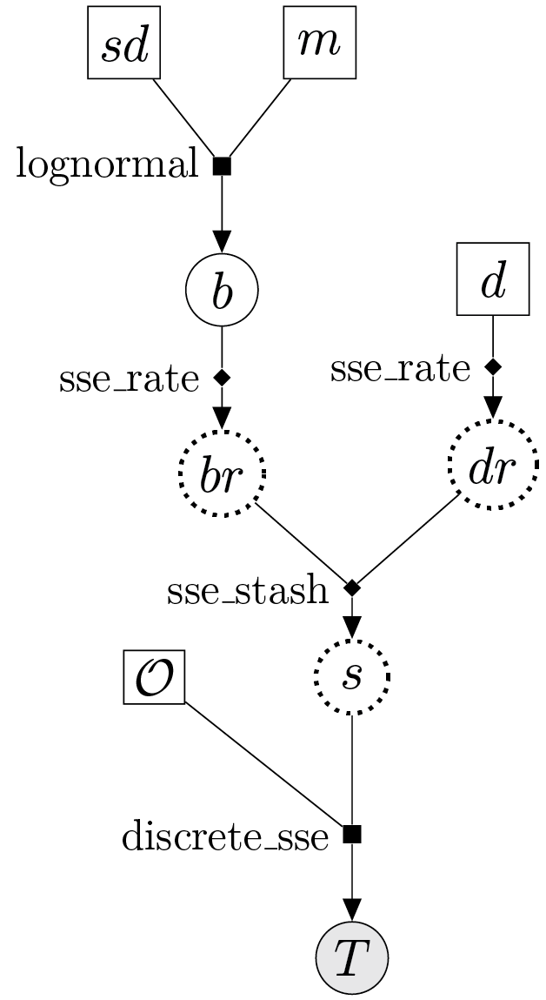

%%%%%%%%%%%%%
Documentation
%%%%%%%%%%%%%

.. contents::
    :local:
    :backlinks: none

--------
Overview
--------

What is PhyloJunction
=====================

Users may find it useful to read the original manuscript introducing |pj| (Mendes and Landis, Journal, 2024).
That paper summarizes the main features of |pj| while providing an account on the motivations underlying its design and development. 

Graphical models
=============================

|pj| follows the graphical model paradigm popularized in the last decade by programs like `RevBayes <https://revbayes.github.io/>`_, `BEAST <https://beast.community/>`_ and `BEAST 2 <https://www.beast2.org/>`_.
In what follows, we shall offer just a brief refresher on what probabilistic graphical models are, and one simple example of their use in evolutionary modeling.
Those interested in a more detailed exposition will find it in Höhna et al. (2014) and references therein (also, take a look `here <https://revbayes.github.io/tutorials/intro/graph_models.html>`_).

Just as with the RevBayes and BEAST programs, specifying a model in |pj| amounts to writing down any number of conditional dependencies among random variables.
When looked at collectively, random variables comprise a type of probabilistic graphical model called a Bayesian network.
As the name suggest, such models can be described as graphs -- directed acyclic graphs (**DAG**), more specifically -- where each node (or vertex) represents a random variable, and each edge a conditional dependency between the two nodes (variables) it connects.

A Bayesian network representing a very simple model can be seen in figure 1a:

..  figure:: ../images/simple_graphical_model_both_manual.png
    :figwidth: 100%
    :scale: 40%
    :align: center

    **Figure 1.** A simple probabilistic model represented by (a) a Bayesian network, and (b) a factor graph.
    From the notation in the main text, :math:`\theta=\{sd, m\}`.
    The dashed box is called a "plate", and for each node it envelops it denotes multiple (in this case, precisely five) i.i.d. draws.
    White and gray nodes denote random variables whose values we do (i.e., data) and do not know (i.e., parameters), respectively.

If we were to pen down what this Bayesian network represents in probability terms, we would arrive at a joint density (assuming continuous variables) given by expression:

.. math::
    :label: jointprob

    f_{\Theta,D}(\theta,d) = f_{\Theta|D}(\theta|D=d)f_D(d) = f_{D|\Theta}(d|\Theta=\theta)f_\Theta(\theta),

where :math:`\theta=\{sd, m\}`.

By comparing the Bayesian network graph and the expression above, the attentive reader will notice that functions are not represented in the graph.
We do not know exactly how random variables are related, other than :math:`\boldsymbol{d}` depending somehow on :math:`sd` and :math:`m`.
This is why it can be helpful to adopt a more general graphical representation: a factor graph (Fig. 1b).

The model underlying the factor graph in figure 1b is the same as that shown by the Bayesian network, the main difference being the additional factor nodes (the filled squares).
Factor nodes can make the relationships between two or more random variables more explicit, especially if their (factor) functions are annotated.

In the example above we can see a factor whose function :math:`f_{D|\Theta}(d|\Theta=\theta)` gives us the probability of random variable :math:`\boldsymbol{d} = \{d_i: 1 \leq i \leq n\}` given :math:`\theta`.
It is annotated as "Normal", so we in fact know a close-form expression for this factor function; it is the probability density function of a normal distribution.
Random variables :math:`sd` and :math:`m` stand for the standard deviation and the mean of that normal distribution.
(For those curious to see just how complicated factor graphs can be, an example can be found in Zhang et al., 2023; see their Supplementary Fig. X.)

How to read a DAG?
------------------

Most biologists specifying a DAG on a computer do so as the first step of statistical **inference**.
They are interested in estimating unknown quantities about the natural world.
These quantities -- the random variables! -- whose values we do not know (but would like to estimate) are referred to as the **parameters** of the model.
Of course, parameter estimation requires that we know the value(s) of one or more random variables, which we naturally refer to as **data**.

In the example in figure 1, the parameters are :math:`sd` and :math:`m`, jointly referred to as :math:`\theta`; the data is node labeled :math:`d_i`.
(Note how they are colored differently, gray for data, white for parameter.)
Carrying out statistical inference thus implies reading the DAG from its data nodes, normally at the bottom, towards the parameter nodes above.

The most natural approach to parameter estimation requires that we simply take the middle and right-hand side terms in equation :eq:`jointprob`,
and solve for :math:`f_{\Theta|D}(\theta|D=d)`, the posterior density function:

.. math::
    :label: bayestheorem

    f_{\Theta|D}(\theta|D=d) = \frac{f_{D|\Theta}(d|\Theta=\theta)f_\Theta(\theta)}{f_D(d)}

This expression is known as Bayes theorem.
What programs like RevBayes, BEAST and BEAST 2 do is evaluate the posterior density function at several values of :math:`\theta`, and output the resulting (posterior) distribution.
 
|pj|, however, is among other things a collection of **simulation** (rather than estimation) engines.
Borrowing the jargon used above, we are now primarily interested in generating values for random variables, some of which are parameters, some data.
Here, it makes sense to think of factors as the distributions from which values will be sampled (though as we will see below, factors can also represent deterministic functions).

As opposed to estimation, simulation starts at the top (or "outer") layers of the DAG, from parameters whose values we do know, and flows in the direction pointed to by arrows (normally downwards; Fig. 1b).
In figure 1b, for example, we start from known values for the parameters of the distributions at the top.
The exponential distribution from which we sample (i.e., simulate) :math:`sd` has a rate of 1.0; the standard normal distribution (:math:`Z`) from which we sample :math:`m`, by definition, has a mean of 0.0 and a standard deviation of 1.0.
We then define a normal distribution from the sampled values of :math:`sd` and :math:`m`, and in turn sample five times from that normal distribution, obtaining our data values in :math:`\boldsymbol{d}`.

Specifying a model (an example)
===============================

|pj| takes a model specification approach that sits between those adopted by the BEAST and RevBayes communities, and that largely intersects with the `LinguaPhylo <https://linguaphylo.github.io/>`_ project.
DAG-building instructions in |pj| are written in its own programming language, *phylojunction* (written in lowercase), whose syntax evokes RevBayes' Rev language.
But unlike Rev, *phylojunction* is not a fully fledged scripting language; it is lightweight and behaves more like a markup language such as XML, BEAST's format of choice.

Commands in *phylojunction* can be read as mathematical statements, and are naturally interpreted as instructions for building a node in a DAG.
Here is what a series of those commands would look like if written as a *phylojunction* script:

.. code-block:: 
    :caption: **Example script 1.** Script written in *phylojunction* specifying a time-homogenous birth-death model

    # hyperprior
    m <- 0.0 # mean of log-normal below
    sd <- 0.1 # standard deviation of log-normal below
    
    # rate values
    d <- 1.0 # death
    b ~ lognormal(mean=m, sd=sd) # birth
    
    # deterministic rate containers
    dr := sse_rate(name="death_rate", value=d, event="extinction")
    br := sse_rate(name="birth_rate", value=b, event="speciation")
    
    O <- 2.0 # origin age
    
    # deterministic parameter stash
    s := sse_stash(flat_rate_mat=[dr, br], n_states=1, n_epochs=1) # parameter stash

    # phylogenetic tree
    T ~ discrete_sse(stash=s, stop="age", stop_value=O, origin="true")

Each line in the above script is a command instructing the application engine to take some form of user input, produce some value from it, and then store that value permanently in a new variable created on the spot.

Every command string consists of an assignment operator (e.g., ``<-``, ``:=``, ``~``) placed between the variable being created (on its left side) and some user input (on its right side).
We can look at some of these commands individually:

* ``d <- 1.0`` creates a variable ``d`` (the death rate) that is then passed and henceforth stores constant value ``1.0``. We use ``<-`` when we know the value of a random variable and want to create a constant node in the DAG;
* ``b ~ lognormal(mean=m, sd=sd)`` creates a variable ``b`` (the birth rate) that will store a random value drawn from a user-specified distribution. Here, that distribution is a log-normal with mean `m` and standard deviation `sd`.
* ``dr := sse_rate(name="death_rate", value=d, event="extinction")`` calls deterministic function ``sse_rate``, which creates variable ``dr`` from the value stored in ``d`` and some other user input. There is no stochasticity to deterministic assignments; they help make explicit steps where variables are transformed, annotated or combined with others.

And this is the DAG such script instantiates:

    **Figure 2.** Factor graph representing the model specified in example script 1.

Note how this DAG has a factor node characterized by a different type of function: deterministic function ``sse_rate``.
Such functions are denoted by filled diamonds instead of filled squares (those represent distributions), and will have their output enclosed in a hollow diamond.

Multiple samples and replicates
-------------------------------

.. code-block:: 

    sd ~ exponential(rate=1)
    m ~ normal(mean=0.0, sd=1.0)
    d ~ normal(n=100, nr=5, mean=m, sd=sd)

------------------------------
Graphical user interface (GUI)
------------------------------

----------------------------
Command-line interface (CLI)
----------------------------

-------
Lexicon
-------

.. toctree::
    :maxdepth: 2

    parametric.rst